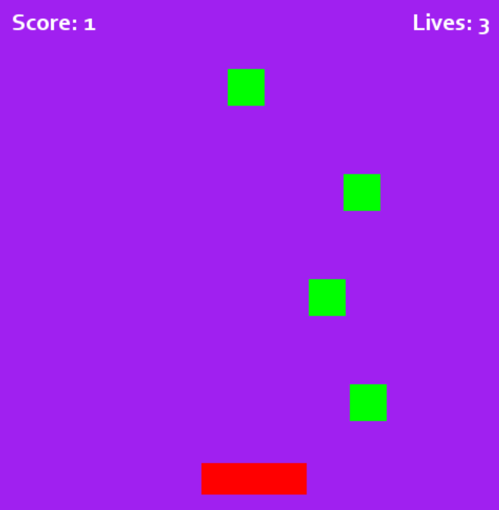
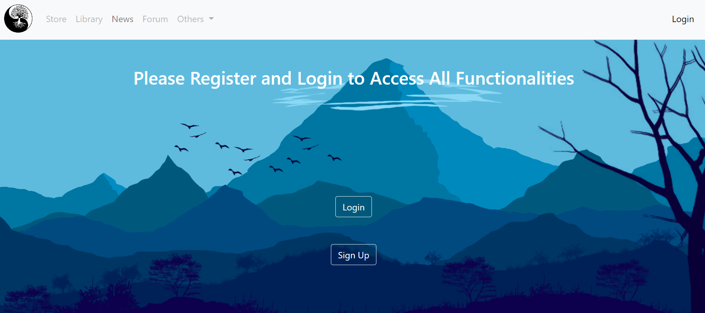
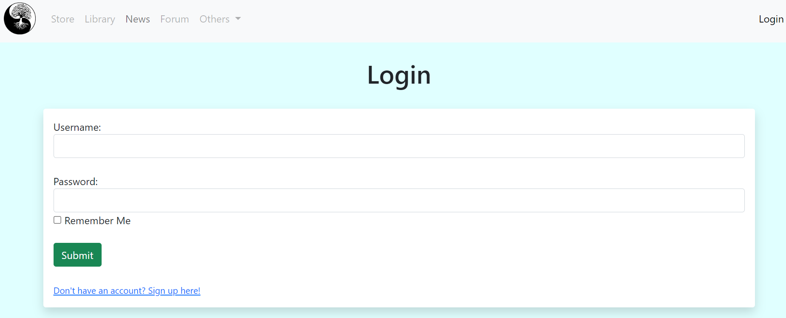

# Brukervennlighet i programmer

Brukervennlighet i programmer går hovedsakelig ut på at programmer, appen eller nettsiden skal være lett å bruke, lett å navigere, eller enkel å forstå ved første bruk. Dette er derfor et veldig bredt tema som tar for seg mye, men i IT2 vil det være viktigst når man snakker om nettsider og spill. Brukervennlighet går derfor mer på interaksjonsdesign, og det viktigste er derfor at koden legger opp for å kunne gjøre design eller funksjonalitet brukervennlig.

## Eksempler

### Eksempel 1

### Eksempel 2

